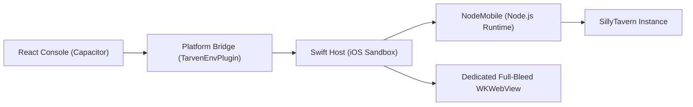

<p align="center">
  
</p>

<h1 align="center">SillyClient iOS</h1>

<p align="center">A dedicated SillyTavern client and instance manager for iOS (No-Jailbreak / NodeMobile / Full-Bleed / Chameleon)</p>

<p align="center">
  <a href="./README.md"><kbd>简体中文</kbd></a>
  <a href="./README.en.md"><kbd>English</kbd></a>
</p>

<p align="center">
  <a href="https://captchaaaaa.github.io/SillyClient/">Project site</a>
  ·
  <a href="https://github.com/CAPTCHAAAAA/SillyClient/releases">Downloads</a>
  ·
  <a href="https://github.com/CAPTCHAAAAA/SillyClient">Main repo</a>
  ·
  <a href="https://github.com/CAPTCHAAAAA/SillyClient-Android">Android source</a>
  ·
  <a href="https://github.com/CAPTCHAAAAA/SillyClient-Windows">Windows source</a>
</p>

SillyClient iOS is a modern SillyTavern client designed specifically for iPhone and iPad. Powered by the embedded NodeMobile runtime, it executes Node.js 22 and SillyTavern natively within the standard iOS application sandbox without requiring jailbreak.

## Features

- **Jailbreak-Free Local Execution**: Hosted natively within the iOS sandbox using NodeMobile bridge and Darwin process controls
- **Comprehensive Instance Management**: Download from GitHub Releases or import from local ZIPs, with custom port configuration
- **Dual WebView Architecture**: Smooth switching between Capacitor management console and full-bleed SillyTavern WKWebView without interrupting background service
- **Chameleon Immersive Visuals**: Automatically samples SillyTavern theme colors and harmonizes with iOS status bar and notch safe areas
- **Sandbox Security & Canonical Paths**: Full compatibility with Darwin `/private/var` symlinks and Documents directory boundaries
- **Data Protection**: Full lossless import and export of user data, character cards, and presets

## Architecture



## Environment

- macOS & Xcode 16+
- iOS 15.0+ devices (arm64) or CoreSimulator
- Node.js 22+ & pnpm 11+
- CocoaPods

## Build & Run

1. Build frontend console assets:
```bash
cd web/capacitor-ui
pnpm install --frozen-lockfile
pnpm run build
cd ../..
```

2. Sync Capacitor iOS native project:
```bash
npx cap sync ios
```

3. Open in Xcode for signing and testing:
```bash
open ios/App/App.xcworkspace
```

Build outputs are unsigned IPAs that can be deployed via AltStore, TrollStore, SideStore, or Xcode.

## License

This project is licensed under the MIT License.
