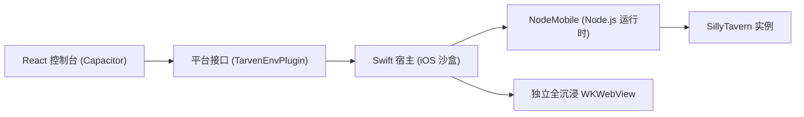

<p align="center">
  
</p>

<h1 align="center">SillyClient iOS</h1>

<p align="center">面向 iOS 平台的 SillyTavern 本地运行与实例管理客户端（免越狱 / NodeMobile / 全沉浸 / 变色龙）</p>

<p align="center">
  <a href="./README.md"><kbd>简体中文</kbd></a>
  <a href="./README.en.md"><kbd>English</kbd></a>
</p>

<p align="center">
  <a href="https://captchaaaaa.github.io/SillyClient/">项目主页</a>
  ·
  <a href="https://github.com/CAPTCHAAAAA/SillyClient/releases">下载安装包</a>
  ·
  <a href="https://github.com/CAPTCHAAAAA/SillyClient">主仓库</a>
  ·
  <a href="https://github.com/CAPTCHAAAAA/SillyClient-Android">Android 源码</a>
  ·
  <a href="https://github.com/CAPTCHAAAAA/SillyClient-Windows">Windows 源码</a>
</p>

SillyClient iOS 端是专为 iPhone 与 iPad 打造的现代化 SillyTavern 启动器。应用内置 NodeMobile 运行时，在 iOS 沙盒内原生运行 SillyTavern 实例，无需越狱即可享受完整的本地酒馆体验。

## 特性

- **免越狱本地运行**：通过 NodeMobile 引擎在 iOS 沙盒内原生托管 Node.js 进程与酒馆服务
- **多实例生命周期**：支持从 GitHub Release 下载或从本地 ZIP 导入实例，支持版本管理与独立端口
- **双 WebView 架构**：Capacitor 现代管理控制台与独立全沉浸 SillyTavern 交互视图无缝切换，手势滑动返回不中断后台服务
- **变色龙全沉浸视觉**：动态提取酒馆背景色并与 iOS 状态栏/刘海屏安全区融合，提供沉浸式全屏体验
- **沙盒安全与规范化路径**：原生适配 Darwin `/private/var` 符号链接与 Documents 安全目录规范，杜绝路径逃逸
- **数据保全**：支持无损导入导出用户数据、角色卡与预设配置

## 架构



## 环境

- macOS 与 Xcode 16+
- iOS 15.0+ 设备（arm64）或 CoreSimulator 模拟器
- Node.js 22+ 与 pnpm 11+
- CocoaPods

## 构建与运行

1. 构建前端控制台静态资源：
```bash
cd web/capacitor-ui
pnpm install --frozen-lockfile
pnpm run build
cd ../..
```

2. 同步 Capacitor 原生工程：
```bash
npx cap sync ios
```

3. 打开 Xcode 进行签名与设备调试：
```bash
open ios/App/App.xcworkspace
```

打包产物为未签名 IPA，可通过 AltStore、TrollStore、SideStore 或 Xcode 直接部署到 iOS 设备上运行。

## 许可证

本项目基于 MIT 许可证开源。
